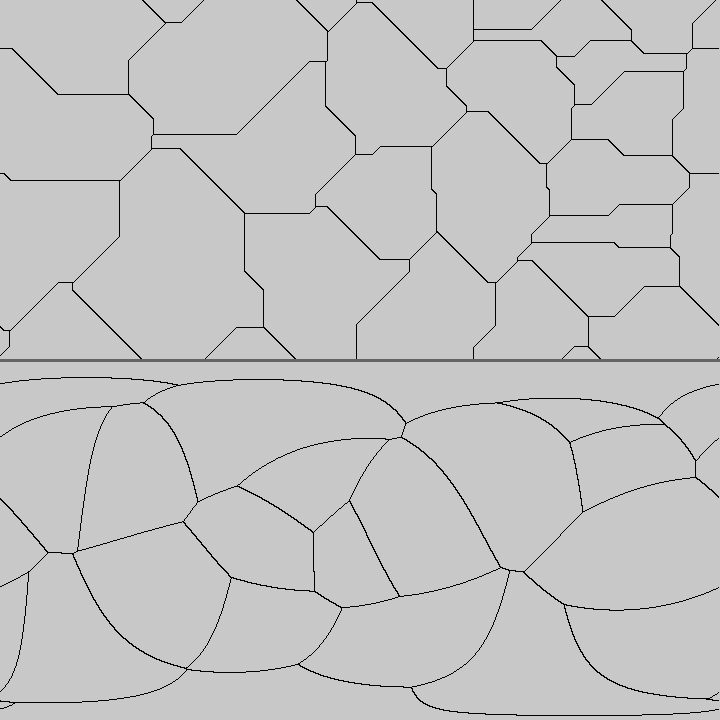

# Fast/Fortran Map Generator (fmap)

`FMAP`is an experimental tool for generating fantasy world maps fast. The goal is to write a relatively simple tool that produces physically believable maps without the need for full-fledged Earth system models. The approach is to mathematically imitate nature where possible, and impose only a few, heavily simplified physics-informed rules, and see how believable I can make it.

The worlds are built by successively adding layers of complexity. First, tectonic plates are imitated through voronoi cells. These are tagged as oceanic or continental. Mountain ranges are added where expected. Topographic noise is added, and landscapes are modified by a simple, imposed climate.

*Tectonic plates are imitated by voronoi cells.*
